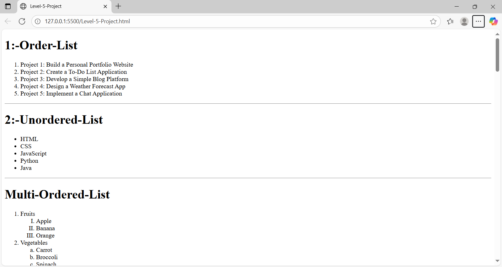
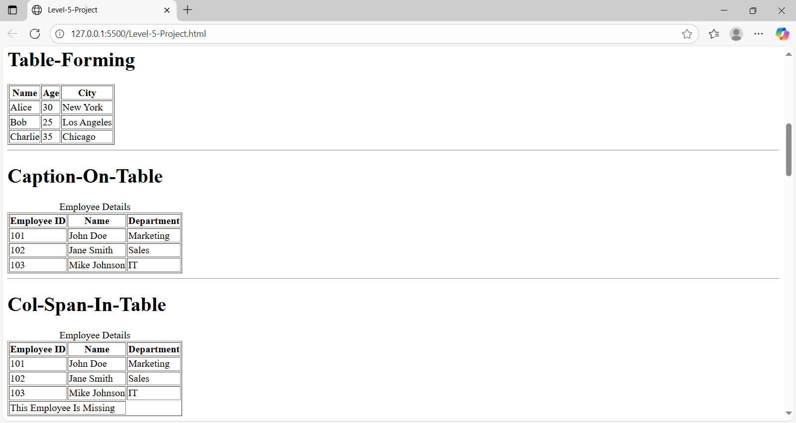
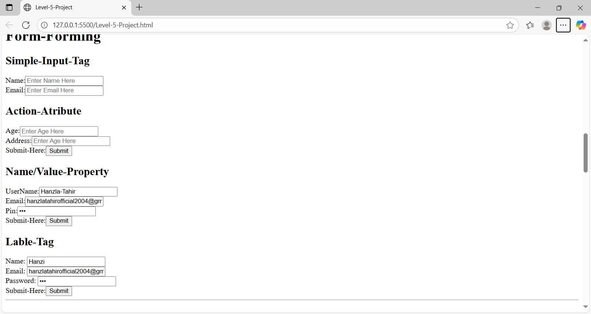
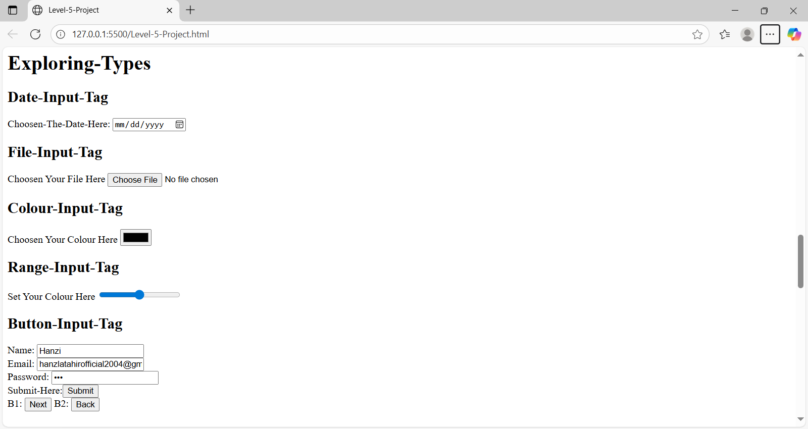
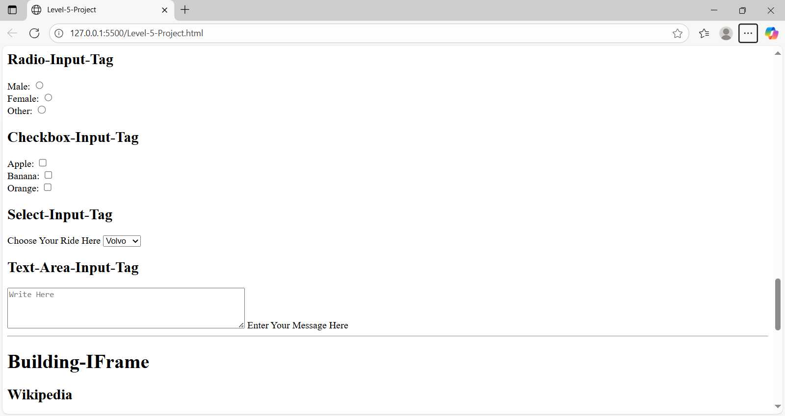
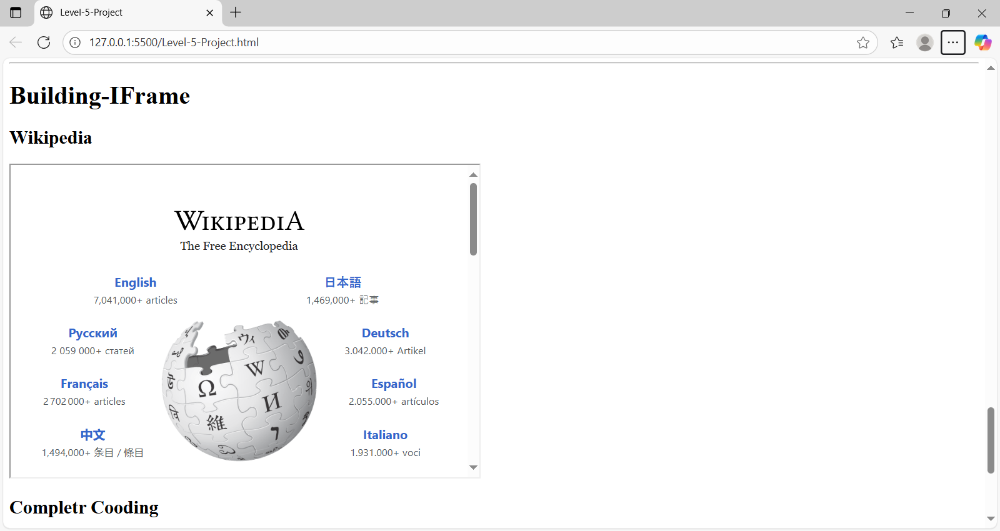

# HTML Complete Forms & Tables Project

This project is a **comprehensive HTML practice project** that demonstrates the use of:
- Ordered and unordered lists
- Nested ordered lists
- Tables with captions and colspan
- Different types of form inputs (text, email, password, radio, checkbox, select, textarea, file, date, etc.)
- Embedding content with iframes

The project is designed for **beginners and intermediate learners** who want to gain hands-on experience with HTML fundamentals.

---

## 📂 Repository Structure

```
HTML-Complete-Forms-and-Tables-Project/
│
├── index.html        # Main project file containing HTML elements
├── README.md         # Project documentation (this file)
├── .gitignore        # Ignored files and folders for git
└── LICENSE           # License file
```

---

## 🚀 How to Use

1. Clone or download this repository.
2. Place the files in your preferred directory.
3. Open `index.html` in your browser.
4. Explore HTML tables, forms, and other components.

---

## 📸 Screenshots

### 🔹 Screenshot 1


### 🔹 Screenshot 2


### 🔹 Screenshot 3


### 🔹 Screenshot 4


### 🔹 Screenshot 5


### 🔹 Screenshot 6

---

## 🌟 Features
✔️ Various list types (Ordered, Unordered, Multi-level)  
✔️ Tables with captions, colspan, and headers  
✔️ All major form input types  
✔️ iFrame embedding (Wikipedia & YouTube)  
✔️ Beginner-friendly HTML structure

---

## 🛠️ Technologies Used
- HTML5

---

## 📜 License
This project is licensed under the **MIT License**.  
You are free to use, modify, and distribute this code for personal or commercial use with proper credit.

---

## 👨‍💻 Author
**Hanzla Tahir**  
Passionate Web Developer & Programmer  
